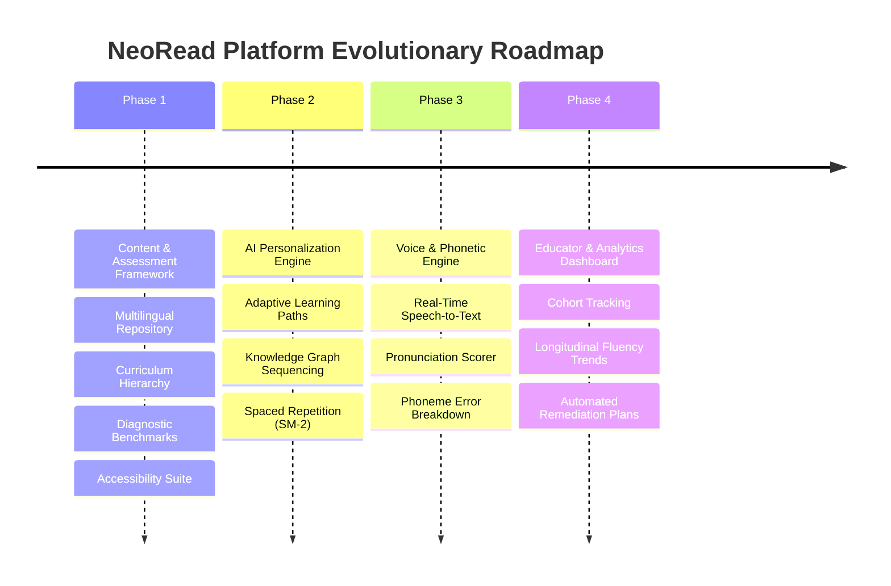
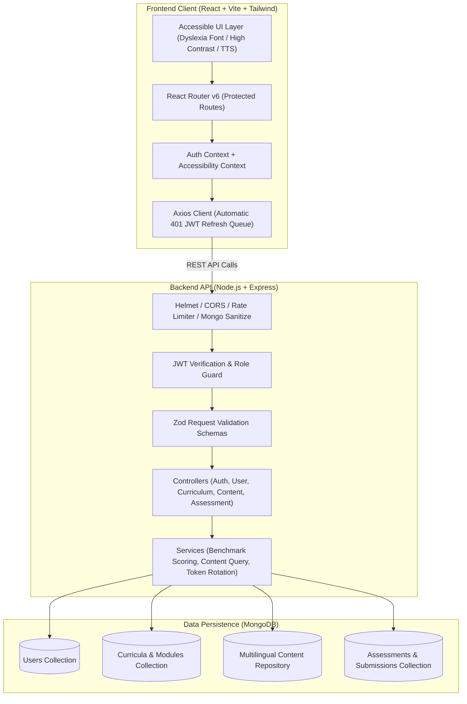
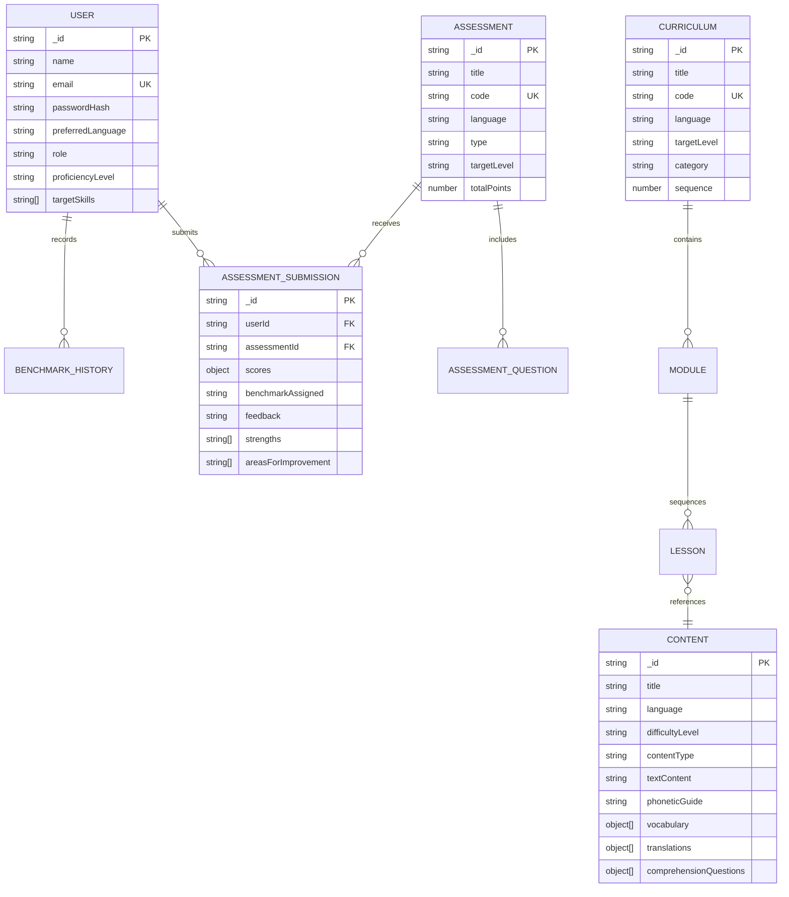
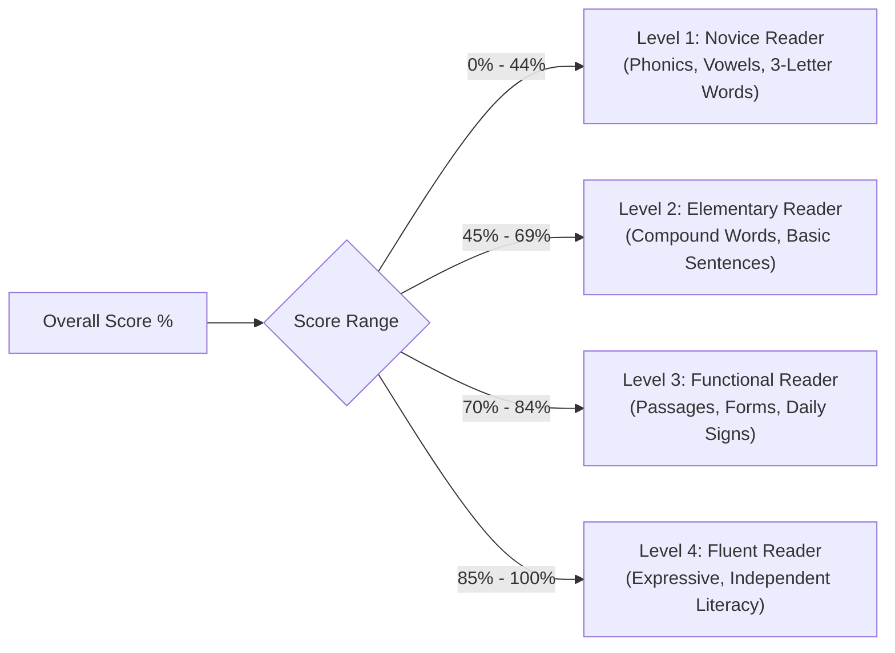
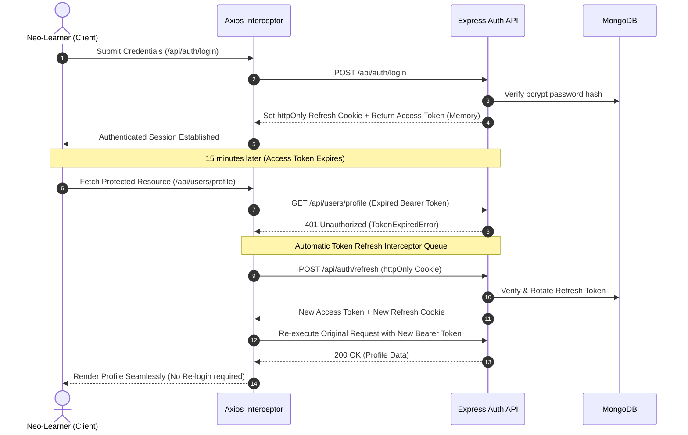

# NeoRead — AI-Based Intelligent Literacy Assistance Platform
## Master Architectural Blueprint & System Design Document

---

## 1. Executive Summary

**NeoRead** is a production-grade, AI-assisted literacy platform engineered specifically for **neo-learners**, adult literacy candidates, and multilingual individuals. Unlike traditional e-learning systems built for literate audiences, NeoRead utilizes an **icon-driven, phonetic-rich, highly accessible architecture** that minimizes text barriers and guides learners step-by-step from alphabet recognition to functional reading fluency.

---

## 2. Four-Phase Evolutionary Roadmap



### Phase Breakdown

| Phase | Focus Area | Key Deliverables | Status |
|---|---|---|---|
| **Phase 1** | **Content Management & Assessment Framework** | • Full-stack Node/Express/Mongo + React/Vite/Tailwind foundation<br>• Hierarchical Curriculum (Modules ➔ Lessons)<br>• Multilingual Content Hub (8 languages with translations & vocabulary cards)<br>• Multi-modal Assessments (Reading, Writing, Comprehension)<br>• Proficiency Benchmarking Algorithm (Novice to Fluent)<br>• Accessibility suite (Dyslexia fonts, TTS narration, High contrast) | **COMPLETED & OPERATIONAL** |
| **Phase 2** | **AI Personalization & Adaptive Engine** | • Knowledge Graph concept dependency modeling<br>• Dynamic difficulty adjustment (DDA)<br>• Spaced repetition memory scheduling (Anki/SM-2)<br>• AI-generated practice exercises & contextual hints | *Scheduled: Weeks 3–4* |
| **Phase 3** | **Voice Recognition & Phonetics** | • Real-time Speech-to-Text (STT) reading aloud evaluation<br>• Phoneme-level pronunciation scoring & error visualization<br>• Audio speed modulation & accent-adaptive acoustic models | *Scheduled: Weeks 5–6* |
| **Phase 4** | **Dashboards & Longitudinal Analytics** | • Educator cohort management & class roster monitoring<br>• Real-time reading fluency progression curves<br>• Automated intervention alert generator & PDF report exporter | *Scheduled: Weeks 7–8* |

---

## 3. High-Level System Architecture



---

## 4. Domain Data Architecture & Relationships



---

## 5. Proficiency Benchmarking Engine

The benchmark algorithm analyzes multi-dimensional responses and calculates normalized weighted indices across three core literacy vectors:

$$\text{Overall Score} = \frac{\sum \text{Earned Points}}{\sum \text{Possible Points}} \times 100$$

$$\text{Reading Index} = \frac{\text{Score}_{\text{Reading}}}{\text{Max}_{\text{Reading}}} \times 100, \quad \text{Writing Index} = \frac{\text{Score}_{\text{Writing}}}{\text{Max}_{\text{Writing}}} \times 100, \quad \text{Comprehension Index} = \frac{\text{Score}_{\text{Comp}}}{\text{Max}_{\text{Comp}}} \times 100$$

### Benchmark Tier Mapping



---

## 6. Authentication & Secure Token Lifecycle



---

## 7. Universal Accessibility Suite

To ensure no learner is left behind, NeoRead adheres to WCAG 2.1 AAA accessibility principles:

1. **Dyslexia-Optimized Typography**:
   - Integrated **Lexend** and customized letter/word spacing (`body.font-dyslexic`) designed by educational typography researchers to reduce visual crowding.
2. **Dynamic High-Contrast Visual Mode**:
   - Deep contrast background palette (`#050811` and `#0f172a`) with high-luminance text elements (`#f8fafc`) for users with low vision.
3. **Multi-tier Text Scaling**:
   - Instant dynamic rem scaling (`1.0rem` ➔ `1.125rem` ➔ `1.25rem`) without breaking responsive layouts.
4. **Interactive Text-to-Speech (TTS) Narration**:
   - Integrated Web Speech API synthesis configured at 0.85x speed for patient, clear pronunciation assistance in all 8 supported languages.

---

## 8. Directory & Scaffolding Standard

```
Project1/
├── BLUEPRINT.md                     # System Architecture Blueprint (This document)
├── README.md                        # Project Guide, Quickstart & Environment Setup
├── postman_collection_Phase1.json   # Postman Collection for Phase 1
├── thunder-collection_Phase1.json   # Thunder Client Collection for Phase 1
├── package.json                     # Root orchestrator scripts
│
├── server/                          # Backend Service
│   ├── src/
│   │   ├── config/                  # db.js, env.js (Zod validated)
│   │   ├── controllers/             # auth, user, curriculum, content, assessment controllers
│   │   ├── middlewares/             # auth, error, validate, asyncHandler
│   │   ├── models/                  # User, Curriculum, Content, Assessment schemas
│   │   ├── routes/                  # Express REST routes
│   │   ├── scripts/                 # seed.js (multilingual data), testEndpoints.js
│   │   ├── services/                # auth.service, benchmark.service, content.service
│   │   ├── utils/                   # apiError, apiResponse, logger (Winston)
│   │   ├── validators/              # Zod schemas for auth, curriculum, content, assessment
│   │   ├── app.js                   # Express application configuration
│   │   └── server.js                # Server entry point
│   ├── .env.example
│   └── package.json
│
└── client/                          # Frontend Application
    ├── src/
    │   ├── api/                     # axiosInstance, authApi, curriculumApi, contentApi, assessmentApi
    │   ├── components/
    │   │   ├── common/              # Button, Input, Card, Modal, Loader, LanguageSwitcher, Badge
    │   │   ├── layout/              # Navbar, Sidebar, Footer, Layout, ProtectedRoute
    │   │   └── assessment/          # AssessmentCard, QuestionRenderer, BenchmarkMeter
    │   ├── context/                 # AuthContext, AccessibilityContext
    │   ├── hooks/                   # useAuth, useAccessibility, useFetch
    │   ├── pages/                   # Home, Login, Register, LearnerProfile, CurriculumList,
    │   │                            # CurriculumDetail, ContentLibrary, AssessmentPage, AssessmentResult
    │   ├── routes/AppRoutes.jsx     # Route declarations
    │   ├── utils/                   # constants, validators
    │   ├── App.jsx
    │   └── main.jsx
    ├── tailwind.config.js
    └── package.json
```

---

## 9. Verification & Quality Assurance Summary

- **Automated API Integration Suite**: 16/16 test assertions passed covering authentication, registration, token refresh, multilingual filtering, assessment submission, and benchmark scoring.
- **Frontend Production Build**: Clean Vite compilation (`dist/`) in 14.87s with zero lint or JSX errors.
- **Database Seeding**: Populated with realistic multilingual curricula, stories, phonetic guides, vocabulary banks, and diagnostic assessments in English, Hindi, and Spanish.
